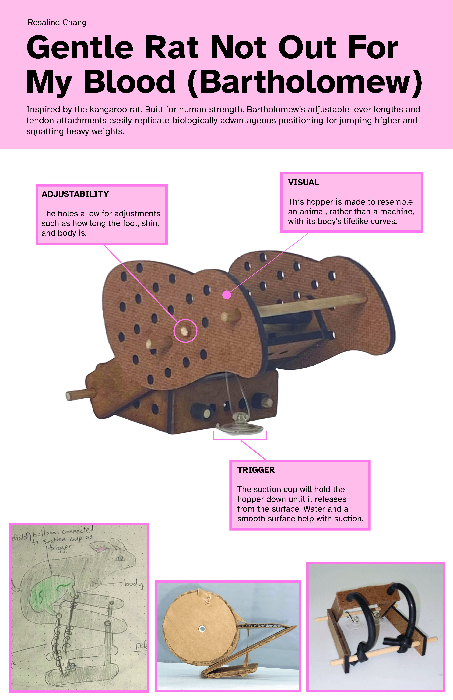
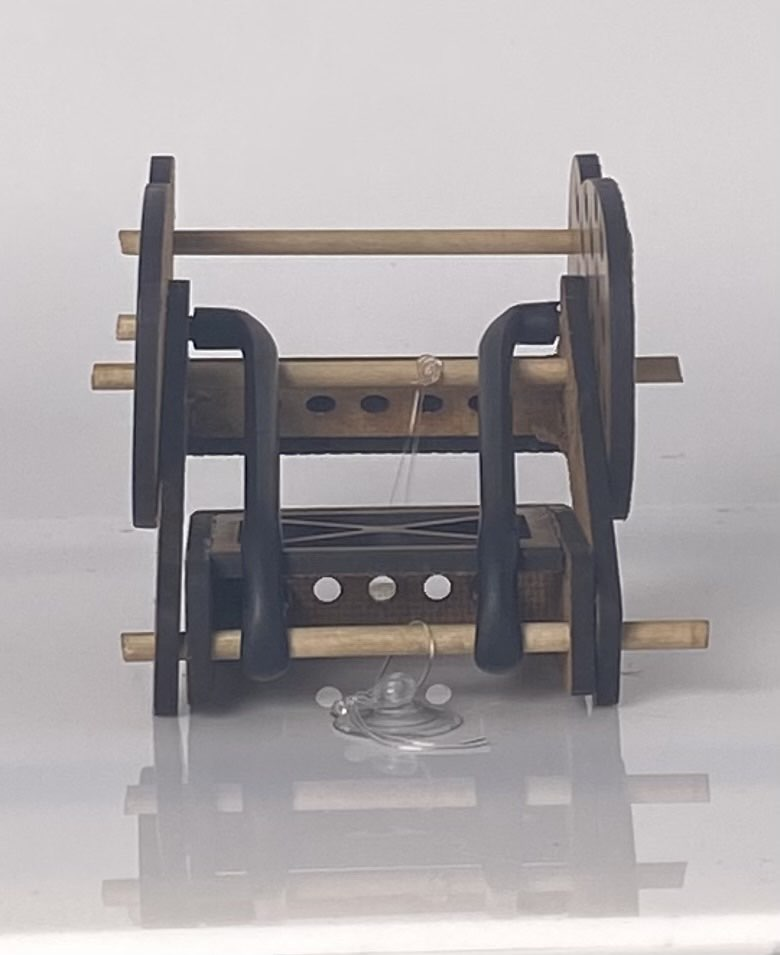

+++
title = 'Hopper Project'
date = 2025-11-01
displayDate = 'November 2025'
author = 'froggor'
summary = "A bio-inspired jumping mechanism."
tags = ["Olin","CAD"]
[cover]
image = "Main_Hopper_Image.png"
hidden = true
hiddenInList = false 
hiddenInSingle = true
relative = true
+++

This was my first project at Olin! I used Solidworks to create a jumping mechanism inspired by a kangaroo rat, and manufactured prototypes using a band saw and drill press. 

  <figure style="flex: 1; margin: 0;">
    
    <figcaption style="text-align: center;">Rear View of Hopper</figcaption>
  </figure>
  
  <figure style="flex: 1; margin: 0;">
    
    <figcaption style="text-align: center;">Hopper Assembly in Solidworks</figcaption>
  </figure>

